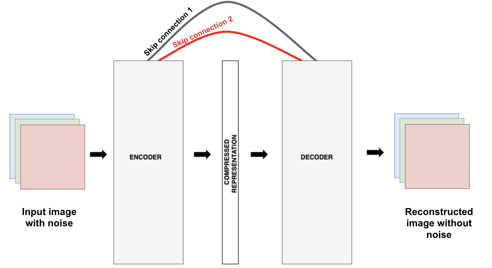
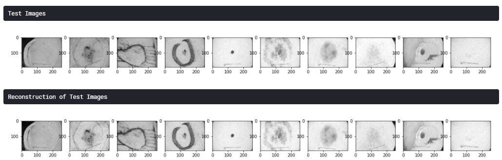

# Reconstructing Medical Images

## Motivation

Medical imaging data sets are often imbalanced as pathologic findings are generally rare, which introduce significant challenges when training deep learning models, but using
deep learning can help. Deep learning is so adept at image work that some AI scientists are using neural networks to create medical images, not just read them. Generative models
like Autoencoder, Variational Autoencoder and GAN use patterns learned from real scans to create synthetic versions of CT or MRI images. The data can be randomly generated and
endlessly diverse, allowing researchers to access large volumes of necessary data without any concerns around patient privacy or consent. Such a strategy could significantly
reduce of enough data.

## Goal:
In this project , I am trying to reconstruct medical images using generative model. I have used Skin Lesion dataset and Autoencoders with skip connections.  

## Dataset: 
* https://www.kaggle.com/hashbanger/skin-lesion-segmentation

## Autoencoder with skip connection
To improve the performance of the autoencoders ‘skip connections’ can be added from the encoder to the decoder, i.e. across the bottleneck. These additional
connections can directly send the feature maps from the an earlier layer of the encoder to a later layer of the decoder. This helps the decoder form more clearly defined
decompressions of the input image.

## Results

## Source:
* https://towardsdatascience.com/using-skip-connections-to-enhance-denoising-autoencoder-algorithms-849e049c0ac9

